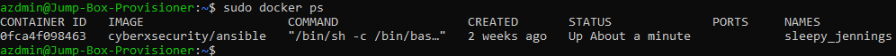

# Elk-Stack-Project

Class Project 1, Elk Stack.

## Automated ELK Stack Deployment

The files in this repository were used to configure the network depicted below.


These files have been tested and used to generate a live ELK deployment on Azure. They can be used to either recreate the entire deployment pictured above. Alternatively, select portions of the playbook file may be used to install only certain pieces of it, such as Filebeat.

  - `/etc/ansible/install-elk.yml` 

This document contains the following details:
- Description of the Topologu
- Access Policies
- ELK Configuration
  - Beats in Use
  - Machines Being Monitored
- How to Use the Ansible Build


### Description of the Topology

The main purpose of this network is to expose a load-balanced and monitored instance of DVWA, the Damn Vulnerable Web Application.

Load balancing ensures that the application will be highly efficient, in addition to restricting traffic to the network.

- What aspect of security do load balancers protect?
  - Load balancing lets you evenly distribute network traffic to prevent failure caused by overloading a particular resource. This strategy improves the performance and  availability of applications, websites, databases, and other computing resources. It also helps process user requests quickly and accurately.  

- What is the advantage of a jump box?
  - A jump box is a hardened and monitored device that controls access to other internal devices.

Integrating an ELK server allows users to easily monitor the vulnerable VMs for changes to the filesystem and system resources.

- Filebeat watch for?
  - Log files and filesystem changes.

- What does Metricbeat record?
  - System-level CPU usage, memory, file system, disk IO, and network IO statistics.

The configuration details of each machine may be found below.

| Name     | Function | IP Address | Operating System |
|----------|----------|------------|------------------|
| Jump-Box | Gateway  | 10.0.0.7   | Linux            |
| Web-1    | Webserver | 10.0.0.10  | Linux            |
| Web-2    | Webserver | 10.0.0.9   | Linux            |
| Elk-VM   | Monitoring | 10.1.0.4   | Linux            |

### Access Policies

The machines on the internal network are not exposed to the public Internet. 

- Only the Jump-Box machine can accept connections from the Internet. Access to this machine is only allowed from the following IP addresses:
  - My home network public IP address.

- Machines within the network can only be accessed by Jump-Box. Which machine did you allow to access your ELK VM? What was its IP address?
  - Local Workstation via SSH from my home network public IP address which a policy has been put in place to allow me to connect to the Jump-Box.

A summary of the access policies in place can be found in the table below.

| Name     | Publicly Accessible | Allowed IP Addresses |
|----------|---------------------|----------------------|
| Jump Box | Yes/SSH | SSH - My home network IP address | 
| Web-1    | Yes/HTTP   | HTTP - any, SSH - 10.0.0.7    |  
| Web-2    | Yes/HTTP    | HTTP - any, SSH - 10.0.0.7   |
| Elk-VM   | Yes/HTTP, SSH |HTTP - any, SSH - 10.0.0.7  |

### Elk Configuration

Ansible was used to automate configuration of the ELK machine. No configuration was performed manually, which is advantageous becausethe main advantage is that you can put commands into multiple servers from a single playbook, like how I combined Filebeat and Metricbeat.

The playbook implements the following tasks:
- Install docker.io
- Install python3-pip
- Install Docker python module
- Configure syslog to use more memory 
- Install ELK Stack
- Enable Docker service

The following screenshot displays the result of running `docker ps` after successfully configuring the ELK instance.



### Target Machines & Beats

This ELK server is configured to monitor the following machines:

| Name     | IP Addresses |
|----------|--------------|
| Web-1 |  10.0.0.10  |
| Web-2 | 10.0.0.9  |


- We have installed the following Beats on these machines:
  - Filebeat and Metricbeat.

- These Beats allow us to collect the following information from each machine:
  - Filebeat monitors log files or locations you specify, collects log events, and forwards them either to Elasticsearch or Logstash for indexing.
  - Metricbeat collects metrics from the operating system and from services running on the server.

### Using the Playbook

In order to use the playbook, you will need to have an Ansible control node already configured. Assuming you have such a control node provisioned: 

SSH into the control node and follow the steps below:

```
$ cd /etc/ansible
$ mkdir files
```
- Copy the playbook files to `/etc/ansible/files`.

You can do a git clone command, `git clone https://github.com/Alyksandar/Elk-Stack-Project.git` to clone the repository and download the playbooks.

Move the Playbooks files into `/etc/ansible/files`.

`$ cp /etc/ansible/Elk-Stack-Project/Ansible/* /etc/ansible/files `

- Update the `/etc/ansible/hosts` file to include the Elk and Webservers private IP addresses. Editing the host file will make Ansilbe run the playbook on a specific machine, and specify which machine to install ELK server on versus which to install Filebeat and Metricbeat.

```
[webservers]
10.0.0.10 ansible_python_interpreter=/usr/bin/python3
10.0.0.9 ansible_python_interpreter=/usr/bin/python3

[elk]
10.1.0.4 ansible_python_interpreter=/usr/bin/python3
```

- Run the playbook, and navigate to Kibana (http://[Host IP]/app/kibana) to check that the installation worked as expected.

```
$ ansible-playbook install-elk.yml
$ ansible-playbook install-filebeat.yml
$ ansible-playbook install-metricbeat.yml
```
- Check that the ELK server is running, http://[Host IP]/app/kibana.

